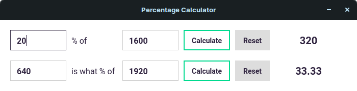

# Percentage Calculator

A hybrid desktop app and browser extension used to calculate percentages.

## Features

- Sleek user interface
- The first input is focused automatically
- The `Tab` key cycles through the inputs
- The `Esc` key resets all the inputs
- The `Enter` key triggers the calculation
- The result is automatically copied to the clipboard

## Installation

Download the latest version [here](https://github.com/andreinadaban/percentage-calculator/releases).
